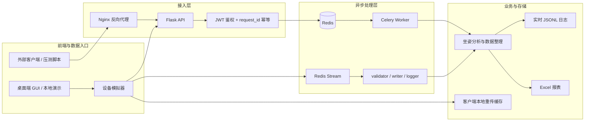
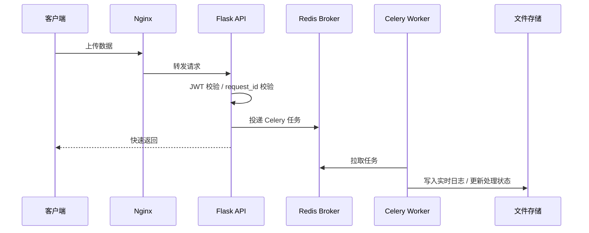
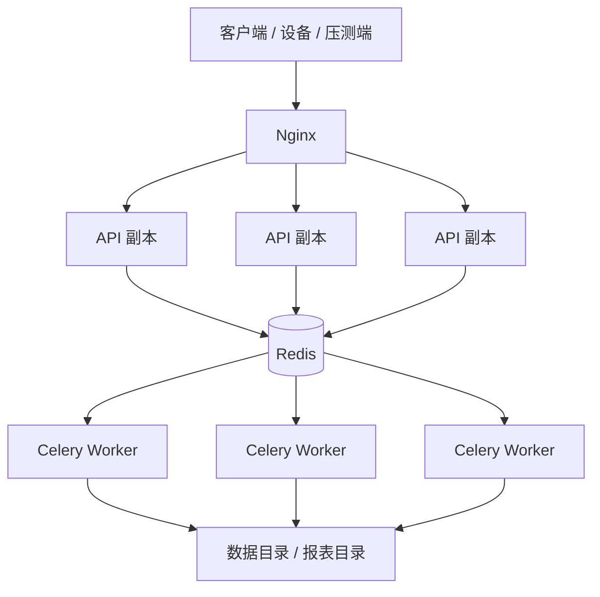

# Moon_Dance 架构总览

本文件是项目唯一的整体架构说明，前端、后端、API、MQ、部署关系都以这里为准。其他文档只保留接口、运维或测试细节，不再重复讲完整架构。

## 一、系统定位

Moon_Dance 当前是一个“设备数据采集 + 坐姿分析 + 异步处理 + 文件输出”的 Python 项目，代码里实际存在两条并行的数据入口：

1. **HTTP API 接入链路**
   - 面向外部客户端或压测脚本
   - 通过 Flask API 接收数据
   - 通过 Celery + Redis 异步处理
   - 是 `deploy/docker-compose.yml` 中默认部署的主链路

2. **桌面端模拟器直连 MQ 链路**
   - 面向本地演示、设备模拟、Redis Stream 验证
   - 由桌面端/模拟器生成数据
   - 同时可发往 API，也可直接发往 Redis Stream
   - 由 `src/mq_workers` 下的独立 Worker 处理

这意味着项目不是“只有一种 MQ 方案”，而是同时保留了：

- **生产主链路**：Flask + Celery + Redis
- **实验/扩展链路**：Redis Stream + 自定义 MQ Worker

## 二、整体架构图



## 三、代码层级与职责

```text
Moon_Dance/
├── main.py                   # 桌面端 / 无头模拟器入口
├── main_api.py               # API 服务入口
├── deploy/
│   ├── docker-compose.yml    # Redis / Nginx / API / Worker 部署编排
│   └── nginx.conf            # 反向代理与负载均衡
├── docs/
│   ├── ARCHITECTURE.md       # 整体架构说明
│   ├── API.md                # 接口契约
│   ├── MQ_ARCHITECTURE.md    # 仅讲消息队列设计
│   └── MQ_TEST_GUIDE.md      # MQ 测试步骤
├── scripts/
│   └── mq_manager.py         # Redis Stream Worker 管理脚本
└── src/
    ├── api/                  # Flask 路由、鉴权、请求处理
    ├── config/               # 配置项、路径、环境变量
    ├── core/                 # 核心业务、Celery Worker、设备模拟器、MQ 客户端
    ├── mq_workers/           # Redis Stream 的独立处理节点
    ├── ui/                   # 桌面端界面逻辑
    └── utils/                # 通用工具
```

## 四、前端、后端、API、MQ 的对应关系

| 领域 | 当前实现 | 代码位置 | 作用 |
|------|----------|----------|------|
| 前端 | 桌面端 GUI | `main.py`、`src/ui/` | 本地演示、监控、驱动模拟采样 |
| 数据入口 | 设备模拟器 | `src/core/device_simulator.py` | 生成压力数据，发送到 API 和/或 MQ |
| API 入口 | Flask 应用启动 | `main_api.py` | 组装 Flask 应用、注册蓝图、启动 HTTP/HTTPS 服务 |
| API 层 | Flask Blueprint | `src/api/routes.py`、`src/api/auth.py` | 对外提供登录、上传、健康检查等接口 |
| 后端核心 | 业务处理与落盘 | `src/core/worker.py`、`src/core/*` | 异步消费任务、记录日志、生成结果 |
| MQ 主链路 | Celery + Redis | `src/core/worker.py` | API 上传后的异步处理 |
| MQ 扩展链路 | Redis Stream + 自定义 Worker | `src/core/mq_client.py`、`src/mq_workers/*` | 模拟器直连消息流、验证与写入 |
| 部署入口 | Docker + Nginx | `deploy/docker-compose.yml` | 生产化运行与横向扩展 |

## 五、API 主链路

### 1. 请求入口

外部客户端通过 HTTP/HTTPS 调用 API：

- 登录获取 JWT
- 上传坐姿数据
- 通过 `request_id` 做幂等控制

主处理顺序如下：



### 2. 主链路上的模块边界

- `src/api/auth.py`
  - 负责登录、JWT 颁发、令牌校验
- `src/api/routes.py`
  - 负责对外暴露上传接口与基础响应
- `src/core/worker.py`
  - 负责 Celery 任务消费、数据整理、结果落盘
- `src/config/settings.py`
  - 负责 Redis 地址、数据目录、日志目录等运行配置

### 3. 为什么 API 链路是“当前主架构”

因为当前容器编排文件只默认启动以下服务：

- Redis
- Nginx
- API
- Celery Worker

也就是说，**默认部署并不会自动启动 `src/mq_workers` 这套 Redis Stream Worker**。因此对外服务时，应把 Flask + Celery 视为当前主架构。

## 六、桌面端与模拟器链路

桌面端不是 Web 前端，而是本地 GUI 工具。它的主要职责是：

- 驱动设备模拟
- 展示实时结果
- 把采集数据送入后端链路

`src/core/device_simulator.py` 当前会做三件事：

1. 在本地生成压力与分析数据
2. 异步调用 HTTP API
3. 在启用 MQ 时，直接把消息发往 Redis Stream

因此桌面端/模拟器其实是一个“双投递入口”：

- 一条走 **HTTP API**
- 一条走 **Redis Stream**

这也是项目里同时存在两套异步处理方案的根本原因。

## 七、MQ 架构拆解

### 7.1 Celery + Redis：默认部署方案

用途：

- 处理 API 上传后的异步任务
- 降低 API 接口的同步阻塞
- 支持通过队列长度做扩容

特点：

- 对外接口稳定
- 与 `docker-compose.yml` 直接对应
- 更适合生产部署

处理链路：

```text
客户端 -> Flask API -> Redis Broker -> Celery Worker -> JSONL/报表
```

### 7.2 Redis Stream：模拟器/扩展方案

用途：

- 设备模拟器直接写消息流
- 验证多节点消费、重传、死信、分工式处理

涉及模块：

- `src/core/mq_client.py`
- `src/mq_workers/base_worker.py`
- `src/mq_workers/validator_worker.py`
- `src/mq_workers/writer_worker.py`
- `src/mq_workers/logger_worker.py`
- `scripts/mq_manager.py`

处理链路：

```text
设备模拟器 -> upstream_data -> validator_worker
          -> validated_data -> writer_worker / logger_worker
          -> dead_letter    -> 失败消息保留
```

适用场景：

- 本地压测与演示
- 验证消息可靠性
- 后续拆分更细粒度微服务时继续演进

### 7.3 两套 MQ 的关系

| 问题 | 当前答案 |
|------|----------|
| 项目有没有 MQ | 有，而且有两套异步通道 |
| 默认部署走哪套 | Celery + Redis |
| Redis Stream 还在不在 | 在，主要用于模拟器直连和扩展实验 |
| 两套是否互斥 | 不互斥，可以并存 |
| 架构文档应该以谁为主 | 以 Celery 主链路为主，再说明 Redis Stream 是补充链路 |

## 八、后端落盘与输出

后端当前以文件输出为主，而不是关系型数据库：

- **实时日志**
  - 保存设备上传后的逐条记录
  - 由 Worker 或写入节点落盘
- **报表文件**
  - 用于批量报表与结果输出
  - 主要为 Excel 产物
- **客户端缓存**
  - MQ 发送失败时，消息先落本地缓存
  - 后续后台线程自动重传

这些目录多数会在运行时自动创建，因此仓库内不需要长期保留空目录。

## 九、部署架构



`deploy/docker-compose.yml` 体现的就是这套部署模型：

- `nginx` 负责入口与负载均衡
- `api` 默认按多副本思路部署
- `worker` 负责异步任务消费
- `redis` 同时承担 Broker / 队列基础设施角色

## 十、推荐阅读边界

为了避免重复，后续文档按下面的边界阅读：

- `ARCHITECTURE.md`
  - 只看整体系统怎么组成
- `API.md`
  - 只看接口定义、请求参数、响应格式
- `MQ_ARCHITECTURE.md`
  - 只看消息队列设计与两套异步方案的边界
- `MQ_TEST_GUIDE.md`
  - 只看如何验证 MQ
- `README_DOCKER.md`
  - 只看如何构建和运行容器

## 十一、架构结论

如果只用一句话概括当前代码结构：

**Moon_Dance 是一个以 Flask API + Celery + Redis 为主运行链路、以桌面模拟器 + Redis Stream 为补充链路、最终把数据写入文件与报表输出的分层 Python 系统。**
