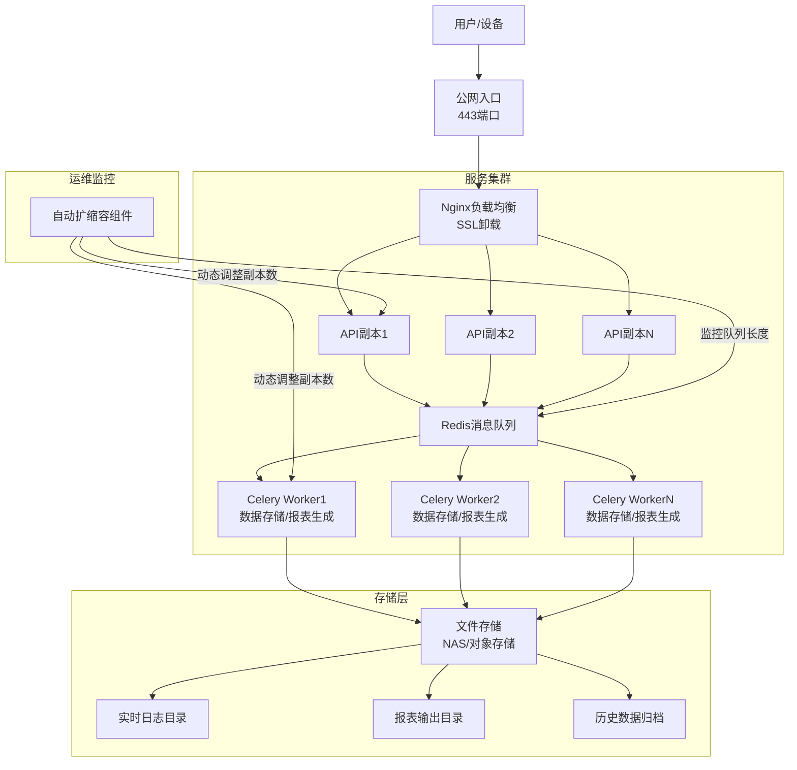
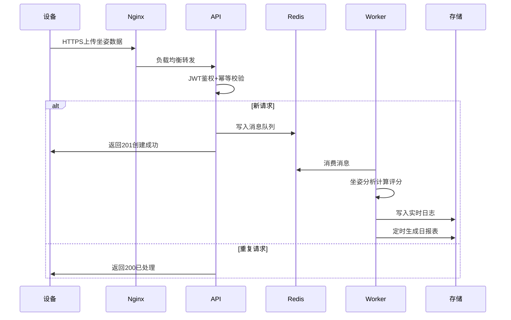

# Moon_Dance 系统架构设计

## 一、总体业务架构

```mermaid
flowchart LR
    A[客户端层] --> B[接入层]
    B --> C[服务层]
    C --> D[数据层]
    
    subgraph A[客户端层]
        A1[智能坐垫设备]
        A2[桌面端GUI监控]
        A3[移动端小程序]
        A4[管理后台]
    end
    
    subgraph B[接入层]
        B1[Nginx负载均衡]
        B2[HTTPS证书管理]
        B3[流量控制/限流]
    end
    
    subgraph C[服务层]
        C1[API服务集群\n多副本水平扩展]
        C2[JWT鉴权/幂等校验]
        C3[坐姿分析核心引擎]
        C4[Celery异步任务集群]
        C5[报表生成服务]
        C6[自动扩缩容组件]
    end
    
    subgraph D[数据层]
        D1[Redis消息队列/缓存]
        D2[JSON实时日志存储]
        D3[Excel报表存储]
        D4[历史数据归档]
    end
```

---

## 二、部署架构（生产环境）

---

## 三、核心数据流

---

## 架构设计说明
1. **高可用性**：API和Worker都支持水平扩展，无单点故障，自动扩缩容根据压力动态调整资源
2. **高性能**：异步解耦上传和计算逻辑，峰值流量通过Redis队列削峰填谷
3. **安全性**：全链路HTTPS、JWT鉴权、幂等校验、生产环境密钥强制校验
4. **可扩展性**：分层设计，各模块解耦，新增功能只需要在对应层添加即可
5. **可维护性**：Docker容器化部署，支持一键启停集群，日志统一存储